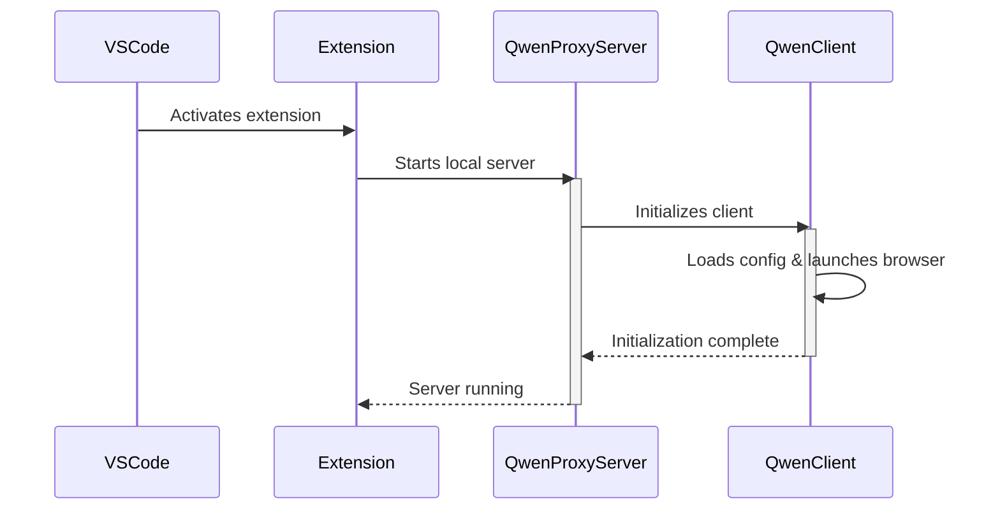
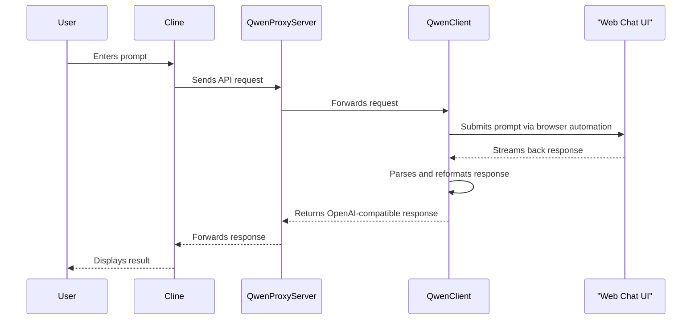
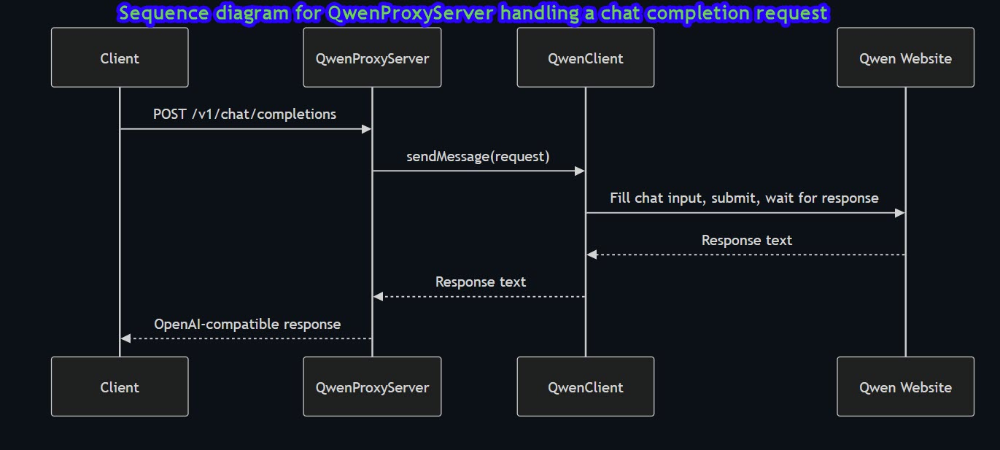
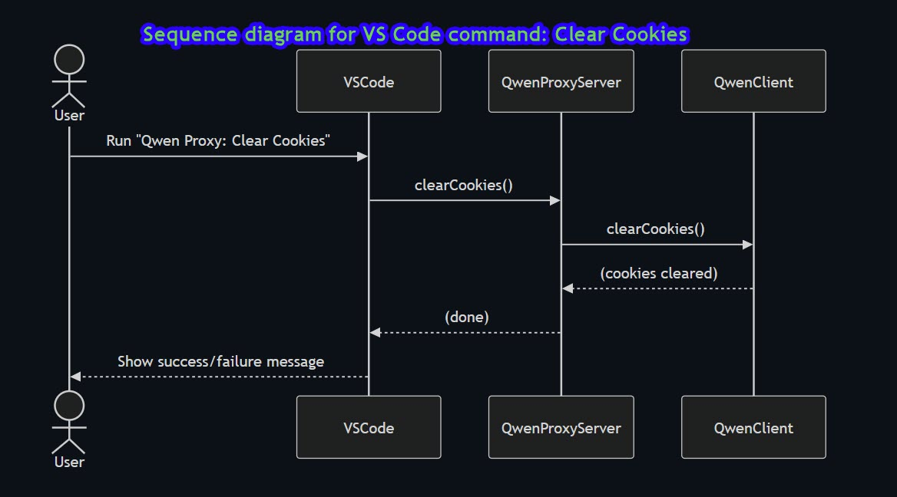
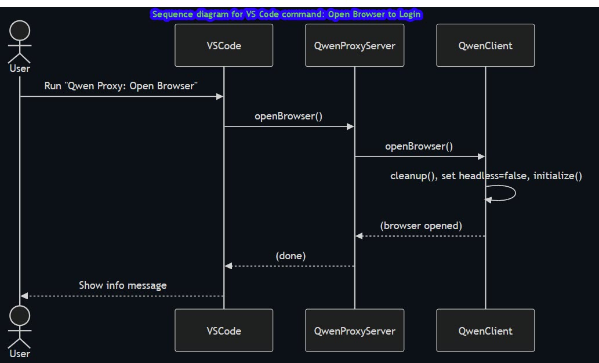
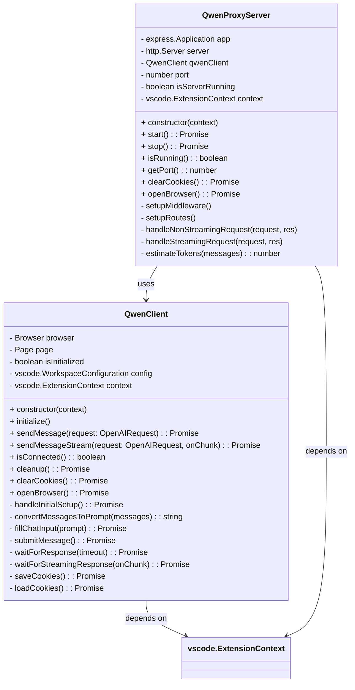

# 🧠 Qwen Bridge: VSCode Extension to Free AI Web Chat

The Qwen Bridge system enables AI-powered code assistance within VSCode using a local proxy and browser automation. Instead of calling paid OpenAI APIs, it interacts with a free web chat interface (like ChatGPT or Claude) using Puppeteer, emulating an OpenAI-compatible API endpoint.

---

## 🚀 Overview Workflow

This project uses a local bridge that:

- Accepts API-style requests from a VSCode extension (e.g., Cline)
- Automates browser interaction with a web-based AI chat
- Parses and returns the response as if it came from OpenAI's API

---

## 📊 Startup Lifecycle Diagram (v0.1.1)

### Mermaid Diagram

---

## 🧬 Prompt-Response Processing Flow

### Mermaid Diagram

---

## 🛠 Components

| Component               | Description                                                                 |
|------------------------|-----------------------------------------------------------------------------|
| `Cline`                | VSCode extension acting as AI code assistant                               |
| `QwenProxyServer`      | Local server emulating OpenAI API                                           |
| `QwenClient`           | Bridge client that controls the browser and processes requests              |
| `Puppeteer`            | Headless browser automation library used to interact with the chat webpage |
| Web Chat Interface     | Target (e.g., ChatGPT, Claude) free web interface                           |

---

## ⚠️ Considerations

- Ensure you comply with the Terms of Service of any AI platform you interact with.
- Expect occasional breakage from site changes or CAPTCHAs.
- Add retry/backoff logic and rate limiting for safety.

---

## 📂 Roadmap

- [ ] Add support for multiple chat UIs (Claude, Gemini, etc.)
- [ ] Snapshot/restore chat sessions
- [ ] Toggle between local LLM and web chat backends
- [ ] Authentication via stored cookies/session replay

---

## 💬 Example Use Case

1. Developer types: `"Explain the difference between map and flatMap in JavaScript"`
2. Cline sends request to QwenProxyServer
3. Browser automation submits it to ChatGPT
4. Response is extracted and returned to the extension
5. Seamless integration without OpenAI API costs

---

  
  

