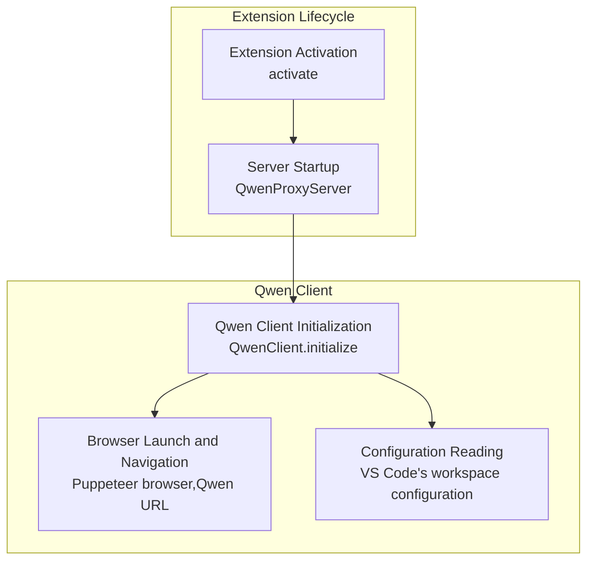

# v0.1.1 - Workflow Diagram

```mermaid
graph TB
  subgraph extension_lifecycle_subgraph["Extension Lifecycle"]
    extensionActivation_node["Extension Activation<br>activate"]
    serverStartup_node["Server Startup<br>QwenProxyServer"]
  end
  subgraph qwen_client_subgraph["Qwen Client"]
    qwenInitialization_node["Qwen Client Initialization<br>QwenClient.initialize"]
    browserLaunch_node["Browser Launch and Navigation<br>Puppeteer browser,Qwen URL"]
    configReading_node["Configuration Reading<br>VS Code's workspace configuration"]
  end
  extensionActivation_node --> serverStartup_node
  serverStartup_node --> qwenInitialization_node
  qwenInitialization_node --> browserLaunch_node
  qwenInitialization_node --> configReading_node
```
